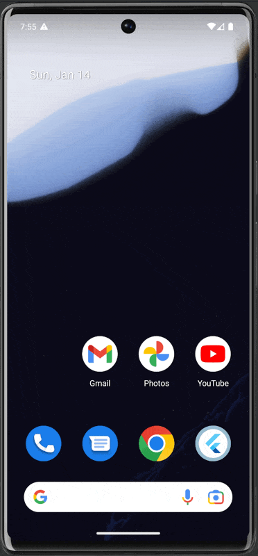

# sourcepoint unified cmp

**NOTE: this is a work in progress - see TODO section for more details**

This is the flutter integration for sourcepoint's unified CMP sdk.

## requirements

Packages:
- dart
- flutter
- swiftformat

```bash
dart pub global activate melos
dart pub global activate very_good_cli
dart pub global activate pana
dart pub global activate flutter_plugin_tools
```

## example usage:

**The flutter api is work in progress and will likely change.**

However there are two main concepts:
- there is a `SourcepointController()` which:
  - takes the account config initially
  - provides a way to load the consent on app startup - either by loading the consent from cache, or explicitly ask the user
  - provides a way to load the consent dialog on demand.
- there is a `SourcepointUnifiedCMPBuilder()` widget which:
  - takes the controller as argument
  - loads the child widget once the consent is available

### sample code:

For a running examples please check the sample app at [example/lib/main.dart](packages/sourcepoint_unified_cmp/example/lib/main.dart) - the sample app can be run using `melos run run:example -- -d sdk` (android only atm).

```dart
// init the controler with the account config
final config = SPConfig(
    accountId: 22,
    propertyId: 7639,
    propertyName: 'tcfv2.mobile.webview',
    pmId: '122058',
);

_controller = SourcepointController(config: config);
```

in the widget tree, the conset can initially be loaded using the `SourcepointUnifiedCMPBuilder`:

```dart
SourcepointUnifiedCMPBuilder(
    controller: _controller,
    builder: (BuildContext context, AsyncSnapshot<SPConsent> snapshot) {
        List<Widget> children;
        if (snapshot.hasData) {
            final consent = snapshot.data;
            debugPrint('user consent has been loaded:');
            debugPrint('   grants: ${consent?.gdpr?.grants}');
            debugPrint('euconsent: ${consent?.gdpr?.euconsent}');
            children = <Widget>[
                Text('Result: we got initial consent'),
            ];
        } else if (snapshot.hasError) {
            children = <Widget>[
                Text('Error: ${snapshot.error}'),
            ];
        } else {
            children = const <Widget>[
                Text('Awaiting consent...'),
            ];
        }
        return children
    },
)
```

**Result:**

When opening the app for the first time, the consent dialog will be shown:


Any subsequent run will load the consent from cache:



In both cases we get this consent output:
```
user consent has been loaded:
    grants: {5e7ced57b8e05c5a7d171cda: GDPRPurposeGrants(granted: false, purposeGrants: {}), 5e37fc3e56a5e60e003a7124: GDPRPurposeGrants(granted: true, purposeGrants: {5e87321eb31ef52cd96cc552: true, 5e87321eb31ef52cd96cc553: true, 5e87321eb31ef52cd96cc554: true, 5e87321eb31ef52cd96cc555: true, 5e87321eb31ef52cd96cc556: true, 5e87321eb31ef52cd96cc558: true, 5e87321eb31ef52cd96cc559: true, 5e87321eb31ef52cd96cc55a: true, 5e87321eb31ef52cd96cc55b: true, 5e87321eb31ef52cd96cc55c: true}), 5e4a5fbf26de4a77922b38a6: GDPRPurposeGrants(granted: true, purposeGrants: {5e87321eb31ef52cd96cc556: true})}
    euconsent: CP4X2gAP4X2gAAGABCENDgCgAL3AAEIAAAYgAHgACAB4AAgDAgAIAMggAEAGQYACADIQABABkOAAgAyKAAQAZAAA.YAAAAAAAAAAA
```

## TODO
- [ ] commit on an api
  - [x] the api for the initial consent loading
  - [ ] api on the on demand loading of the consent message
  - [ ] implementation of a `SourcepointEventDelegate` which allows the flutter stack to hook onto consent events
  - [ ] commit on namings, at the moment the *public* api of this packages does not stick to a single rule, sometimes it's *SourcepointUnifiedCMP*, sometimes it's *SourcepointCMP*, and in other places just *Sourcepoint*
- [ ] implementation for ios/swift
- [ ] implementation of tests
- [ ] open source this as a proper flutter package.
  - [ ] add proper (dart) documentation
- [ ] additional apis:
  - [ ] ingesting consent into platforms webviews
  - [ ] more app samples

## resources
- [Flutter](https://flutter.dev/)
- [Flutter documentation](https://flutter.dev/docs)
- [using melos and very_good_cli](https://adityadroid.medium.com/flutter-at-scale-code-sharing-using-a-monorepo-a7a46c427141)
- [very good dev](https://vgv.dev)
- [melos](https://melos.invertase.dev)
- [example melos + pigeon repo: flutterfire](https://github.com/firebase/flutterfire/)