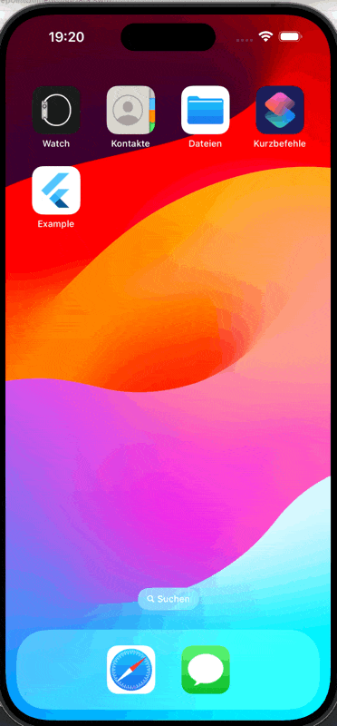
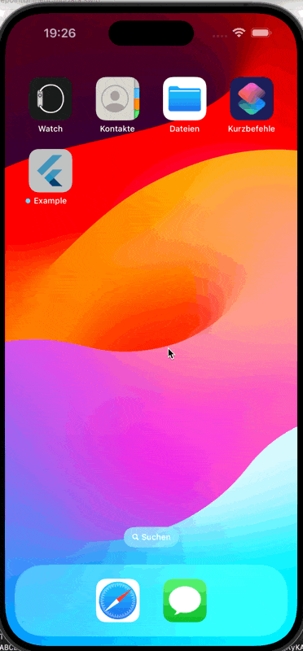

# sourcepoint unified cmp

  [](https://sonarcloud.io/summary/new_code?id=thekorn_sourcepoint_unified_cmp)

This is the flutter integration for sourcepoint's unified CMP sdk.

## Contributing to the project

Please the [CONTRIBUTING.md](CONTRIBUTING.md) for details.

## example usage:

**The flutter api is work in progress and will likely change.**

However there are two main concepts:
- there is a `SourcepointController()` which:
  - takes the account config initially
  - provides a way to load the consent on app startup - either by loading the consent from cache, or explicitly ask the user
  - provides a way to load the consent dialog on demand.
- there is a `SourcepointUnifiedCMPBuilder()` widget which:
  - takes the controller as argument
  - loads the child widget once the consent is available

### sample code:

For a running examples please check the sample app at [example/lib/main.dart](packages/sourcepoint_unified_cmp/example/lib/main.dart) - the sample app can be run using `melos run run:example -- -d sdk` (android) or `melos run run:example -- -d IPhone` (ios).

```dart
// init the controller with the account config
final config = SPConfig(
    accountId: 22,
    propertyId: 7639,
    propertyName: 'tcfv2.mobile.webview',
    pmId: '122058',
);

_controller = SourcepointController(config: config);
```

in the widget tree, the consent can initially be loaded using the `SourcepointUnifiedCMPBuilder`:

```dart
SourcepointUnifiedCMPBuilder(
    controller: _controller,
    builder: (BuildContext context, AsyncSnapshot<SPConsent> snapshot) {
        List<Widget> children;
        if (snapshot.hasData) {
            final consent = snapshot.data;
            debugPrint('user consent has been loaded:');
            debugPrint('   grants: ${consent?.gdpr?.grants}');
            debugPrint('euconsent: ${consent?.gdpr?.euconsent}');
            children = <Widget>[
                Text('Result: we got initial consent'),
            ];
        } else if (snapshot.hasError) {
            children = <Widget>[
                Text('Error: ${snapshot.error}'),
            ];
        } else {
            children = const <Widget>[
                Text('Awaiting consent...'),
            ];
        }
        return children
    },
)
```

**Result:**

When opening the app for the first time, the consent dialog will be shown:

 

Any subsequent run will load the consent from cache:

 

In both cases we get this consent output:
```
user consent has been loaded:
    grants: {5e7ced57b8e05c5a7d171cda: GDPRPurposeGrants(granted: false, purposeGrants: {}), 5e37fc3e56a5e60e003a7124: GDPRPurposeGrants(granted: true, purposeGrants: {5e87321eb31ef52cd96cc552: true, 5e87321eb31ef52cd96cc553: true, 5e87321eb31ef52cd96cc554: true, 5e87321eb31ef52cd96cc555: true, 5e87321eb31ef52cd96cc556: true, 5e87321eb31ef52cd96cc558: true, 5e87321eb31ef52cd96cc559: true, 5e87321eb31ef52cd96cc55a: true, 5e87321eb31ef52cd96cc55b: true, 5e87321eb31ef52cd96cc55c: true}), 5e4a5fbf26de4a77922b38a6: GDPRPurposeGrants(granted: true, purposeGrants: {5e87321eb31ef52cd96cc556: true})}
    euconsent: CP4X2gAP4X2gAAGABCENDgCgAL3AAEIAAAYgAHgACAB4AAgDAgAIAMggAEAGQYACADIQABABkOAAgAyKAAQAZAAA.YAAAAAAAAAAA
```

There two ways to react on consent changes:

1. by registering event listener. This allows you to get notified with the `SPConsent` object whenever the consent changes:

```
    _controller = SourcepointController(config: config)
      ..addListener(() {
        debugPrint('CONSENT CHANGE NOTIFIER: Consent string: '
            '${_controller.consent?.gdpr?.euconsent}');
      });
```

2. by using an event delegate. Besides being able to get notified about consent changes, you can also get more fine grained events from the consent dialog, like `onUIReady`, `onError`, `onAction`, `onConsentReady`, `onConsentChanged`, `onSpFinished`:

```dart
  _controller = SourcepointController(config: config)
    ..setEventListener(
      SourcepointEventListener(
        onConsentReady: (SPConsent consent) {
          debugPrint('EVENT onConsentReady: Consent string: '
              '${consent.gdpr?.euconsent}');
        },
        onConsentChanged: (SPConsent consent) {
          debugPrint('EVENT onConsentChanged: Consent string: '
              '${consent.gdpr?.euconsent}');
        },
      ),
    );
```

with those delegates in place we can now also add a button to load the consent dialog on demand:

```dart
  TextButton(
    onPressed: () {
      _controller.loadPrivacyManager(
        pmId: '122058',
      );
    },
    child: const Text('Load Privacy Manager'),
  )
```

 

Which results in
```

DELEGATE onConsentReady: Consent string: CP4u7EAP4u7EAAGABCENDgCgAAAAAAAAAAYgAAAAAAAA.YAAAAAAAAAAA
DELEGATE SpFinished: Consent string: CP4u7EAP4u7EAAGABCENDgCgAAAAAAAAAAYgAAAAAAAA.YAAAAAAAAAAA
```
